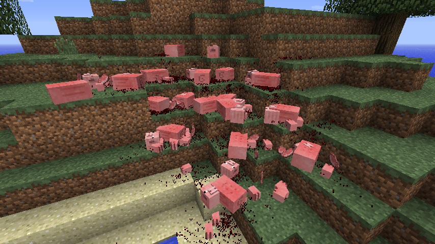
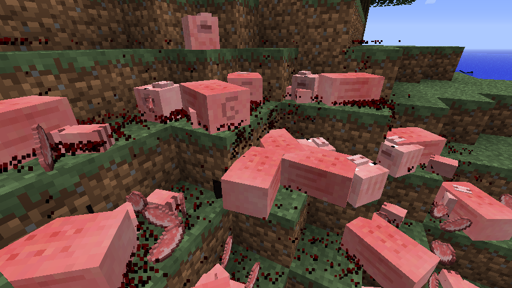
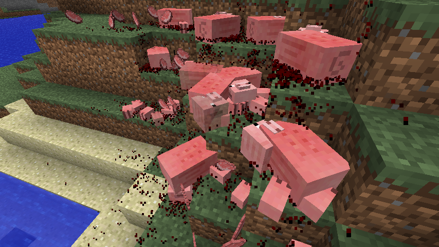
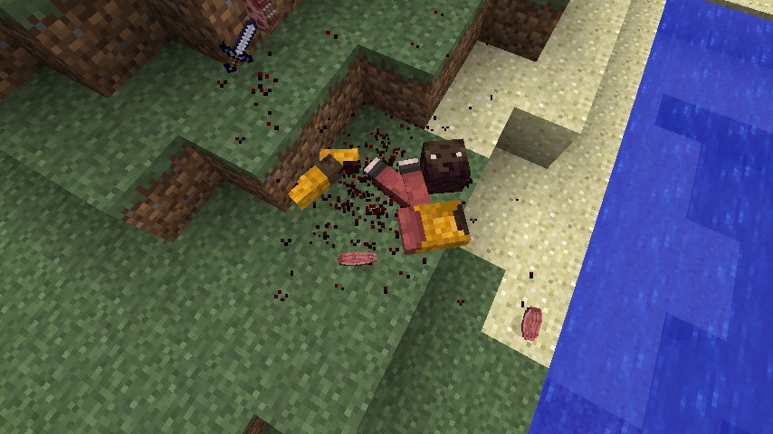

# Makes mobs drop their body parts when they die!
This mod is client side only which means that it could be used on any server! (Maybe, it wasn't tested on any server in v0.9.0, but it was made "client-sided")

Keep in mind that this mod isn't perfect yet, it has some known minor bugs and might have unknown bugs that cause render issues and might cause client crashes.

###### This mod is inspired by IChun's Mob Dismemberment which added only zombie, skeleton and creeper body parts, but this mod extends it to almost all mobs.

## Update v1.0.0 plans:
- Test WAILA mod compatibility, gib might be treated as normal mob therefore might have tooltip with name and other properties
- Test server compatibility
- Test mod compatibility with custom mobs and modified vanilla mob textures
- Fix gib scale, right now its static in many cases like Cave Spider gib being size of normal Spider gib
- Add missing mob models support: SnowMan, IronGolem, EnderDragon, Horse, Giant Zombie and Wither + models from other mods if any important ones would be found
- Fix how Villager gib spawn, right now it spawns only and only if there's no Zombie nearby, yet it must check not for nearby mobs but for conversion to Zombie Villager
- Add Bat wing parts gib, right now Bat drop only head gib and body gib

### Long term plans:
- Split mod into 2 mods, 1st for client only as it is right now and 2nd for client and server so gib would be saved to world and would be interactable with blocks like Tripwire and Pressure Plate
- Mob Amputation mod: when mob attacked by player in specific area of model it could drop its gib part, for example player could attack Zombie into head with Battle Axe, and it would fall of with blood splashing from Zombie's neck and Zombie lowly losing health, when player attacks hand, Zombie would lose base damage, when leg attacked Zombie would either move slower ir fall on the ground and start crawling
- Blood and Gore mod: blood particles, meat clump entities and many other things appear when entities get damaged, meat clump could replace some gib, hurt player loses blood
  